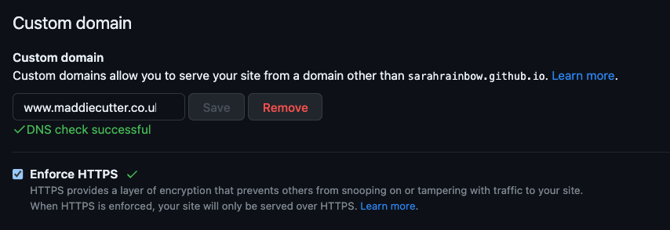

# maddie-web

A place to showcase the brilliance of Mabbie Cuttler

## Pushing changes live

1. push commits to master branch
2. run the command below to push changes live

```
git subtree push --prefix express origin gh-pages
```

if that fails then:

```
git push origin `git subtree split --prefix express master`:gh-pages --force
```

Changes should now be visible at [maddiecutter.co.uk](https://maddiecutter.co.uk)

## Troubleshooting
On pushing changes to the `gh-pages` branch, if visiting [maddiecutter.co.uk](https://maddiecutter.co.uk) gives a
`404 There isn't a GitHub Pages site here.` error, make sure that the Custom Domain field in the GitHub Pages 
section of this GitHub repository Pages settings is filled in correctly like so:

